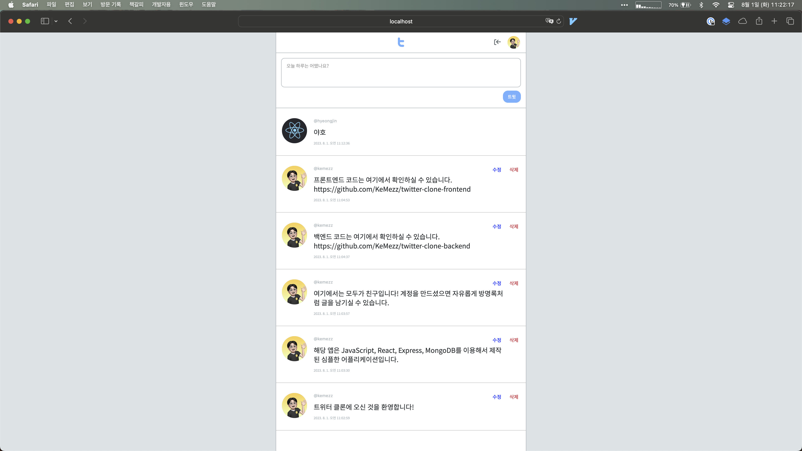

  

<h1 align="center">
  심플 트위터 클론 (백엔드)
</h1>

  

## 👻 소개

심플한 트위터 클론 프로젝트입니다. Node.js 기반의 기초적인 백엔드 기술을 활용하여 계정 생성과 트윗에 대한 CRUD 기능을 구현하였습니다.

## 🔧 주요 기술

- JavaScript
- Express
- MongoDB

## 🚀 배포

MongoDB Atlas

## 🔗 링크

[트위터 클론 프론트엔드 레포지터리](https://github.com/KeMezz/twitter-clone-frontend)
